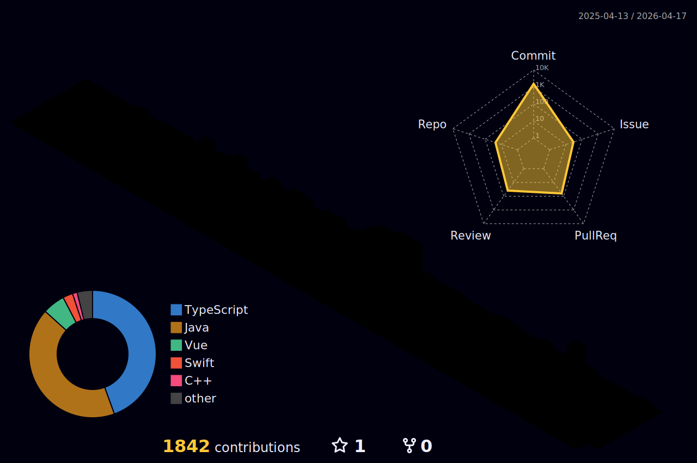

<!-- ======================= -->
<!-- 🌟 Welcome Section -->
<!-- ======================= -->

# 안녕하세요! 개발자 오창은입니다 👋

자동차 산업의 디지털 전환 경험을 바탕으로  
사용자 중심의 웹 서비스를 만드는 풀스택 개발자입니다.

## Activity

Hyundai AutoEver Mobility School – Fullstack Track  *(2025.04 ~ 2025.11)*
 
GIT Internship – Automotive Communication Desktop Development *(2024.07 ~ 2024.12)*

## Algorithm Problem Solving

## Tech Stack

| Category | Tech |
|---------|------|
| **Frontend** |        |
| **Backend** |    |
| **Database** |   |
| **State Management** |    |
| **Cloud / Hosting** |   |

  

✨ 감사합니다! 방문해주셔서 좋은 하루 되세요 :)
