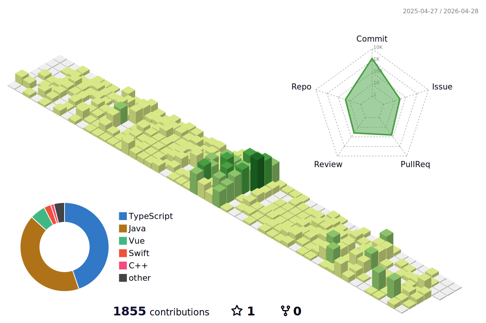

<!-- ======================= -->
<!-- 🌟 Welcome Section -->
<!-- ======================= -->

 
<!-- -->

> 자동차 산업의 디지털 전환 경험을 바탕으로 사용자 중심의 웹 서비스를 만드는 개발자 **오창은**이라고 합니다.
 

## Activity

**✓ Hyundai AutoEver SW Mobility School 2th - Fullstack Track** *(2025.04 ~ 2025.11)*
 
**✓ GIT Internship - Automotive Desktop Development** *(2024.07 ~ 2024.12)*
  

## Algorithm Problem Solving

  

## Tech Stack

| Category | Tech |
|---------|------|
| **Frontend** |        |
| **Backend** |    |
| **Database** |   |
| **State Management** |    |
| **Cloud / Hosting** |   |

 

## GitHub contributions

